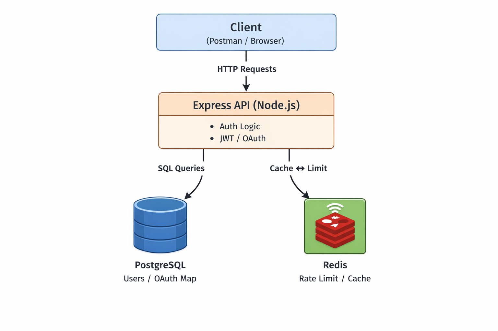

#  OAuth2 Authentication & Authorization Microservice

A production-ready, fully containerized authentication and authorization service built with **Node.js**, **JWT**, and **OAuth 2.0 (Google & GitHub)**.  
This project demonstrates secure identity management, role-based access control (RBAC), and scalable backend architecture using Docker.

---

##  Project Overview

This service acts as a centralized **authentication microservice** that supports:

- Email & password authentication
- OAuth 2.0 authentication (Google & GitHub)
- JWT-based access & refresh tokens
- Role-Based Access Control (RBAC)
- Rate limiting to prevent brute-force attacks
- PostgreSQL for persistent storage
- Redis for caching and rate limiting
- Full Docker & Docker Compose orchestration

---

##  System Architecture

The application follows a **layered architecture** for maintainability, scalability, and security.
```
Client (Postman / Browser)
|
v
Express API (Auth Routes)
|
v
Controllers (Auth Logic)
|
v
Services (JWT / OAuth / RBAC)
|
v
PostgreSQL (Users & Providers)
|
v
Redis (Rate Limiting / Cache)
```
---
###  Architecture Diagram




---

## Technology Stack

| Layer | Technology |
|-----|-----------|
| Runtime | Node.js |
| Framework | Express.js |
| Authentication | JWT (Access + Refresh Tokens) |
| OAuth Providers | Google, GitHub |
| Password Hashing | bcrypt (10 rounds) |
| Database | PostgreSQL |
| Cache / Rate Limit | Redis |
| Security | Rate Limiting |
| Containerization | Docker & Docker Compose |

---

##  Authentication & Authorization Flow

### 1️ Local Authentication (Email & Password)

1. User registers with email & password
2. Password is hashed using bcrypt
3. User logs in with credentials
4. Server validates password hash
5. Access & Refresh tokens are issued

---

### 2️ OAuth 2.0 Authentication (Google / GitHub)

1. User initiates OAuth login
2. Redirected to provider (Google/GitHub)
3. Provider returns authorization code
4. Server exchanges code for profile data
5. User is created or linked in database
6. JWT tokens are issued

OAuth accounts are linked via the **auth_providers** table.

---

### 3 Role-Based Access Control (RBAC)

| Role | Permissions |
|----|------------|
| user | View/update own profile |
| admin | View all users, admin endpoints |

RBAC is enforced using middleware.

---

##  Database Schema

### users table

| Column | Type | Constraints |
|-----|-----|-----------|
| id | UUID | Primary Key |
| email | VARCHAR | Unique, Not Null |
| password_hash | VARCHAR | Nullable |
| name | VARCHAR | Not Null |
| role | VARCHAR | Default 'user' |
| created_at | TIMESTAMP | Default NOW() |

---

### auth_providers table

| Column | Type | Constraints |
|------|------|------------|
| id | UUID | Primary Key |
| user_id | UUID | FK → users(id) |
| provider | VARCHAR | Not Null |
| provider_user_id | VARCHAR | Not Null |
| UNIQUE | (provider, provider_user_id) | Enforced |

---

##  Docker Setup

### Services

- **app** – Express authentication service
- **db** – PostgreSQL database
- **cache** – Redis cache

### Start Application

```bash
docker compose up --build
```
Verify Containers
```
docker ps
```
All services must be healthy.
---
## Environment Variables

Create a .env file (refer .env.example):
```
API_PORT=4000

DATABASE_URL=postgres://postgres:postgres@db:5432/auth_service
REDIS_URL=redis://cache:6379

JWT_SECRET=your_access_secret
JWT_REFRESH_SECRET=your_refresh_secret

GOOGLE_CLIENT_ID=your_google_client_id
GOOGLE_CLIENT_SECRET=your_google_secret

GITHUB_CLIENT_ID=your_github_client_id
GITHUB_CLIENT_SECRET=your_github_secret
```
---

## API Endpoints
### Public Endpoints
```
Method	Endpoint	        Description
POST	/api/auth/register	Register new user
POST	/api/auth/login	    Login user
GET	    /api/auth/google	Google OAuth
GET	    /api/auth/github	GitHub OAuth
POST	/api/auth/refresh	  Refresh JWT
```
### Protected Endpoints
```
Method	Endpoint	     Access
GET	   /api/users/me	User / Admin
PATCH  /api/users/me	User / Admin
GET	   /api/users	    Admin only
```

---
## Postman Testing Guide

Login (Admin)
```
POST http://localhost:4000/api/auth/login
```
```
{
  "email": "admin@example.com",
  "password": "AdminPassword123!"
}
```
Get Profile
```
GET http://localhost:4000/api/users/me
```

Authorization: Bearer <accessToken>

Admin-Only Endpoint
```
GET http://localhost:4000/api/users
```
Authorization: Bearer <adminAccessToken>

---
## Security Measures

- Password hashing with bcrypt

- JWT expiration strategy

- Rate limiting (10 requests / minute)

- RBAC middleware

OAuth provider verification

## Scaling Considerations

For millions of users:

- Horizontal scaling using Docker/Kubernetes

- Read replicas for PostgreSQL

- Redis clustering

- Token revocation lists

CDN for OAuth redirects
---

## Submission 
```
{
  "testCredentials": {
    "adminUser": {
      "email": "hari@example.com",
      "password": "UserPassword123!"
    },
    "regularUser": {
      "email": "user@example.com",
      "password": "UserPassword123!"
    }
  }
}
```
